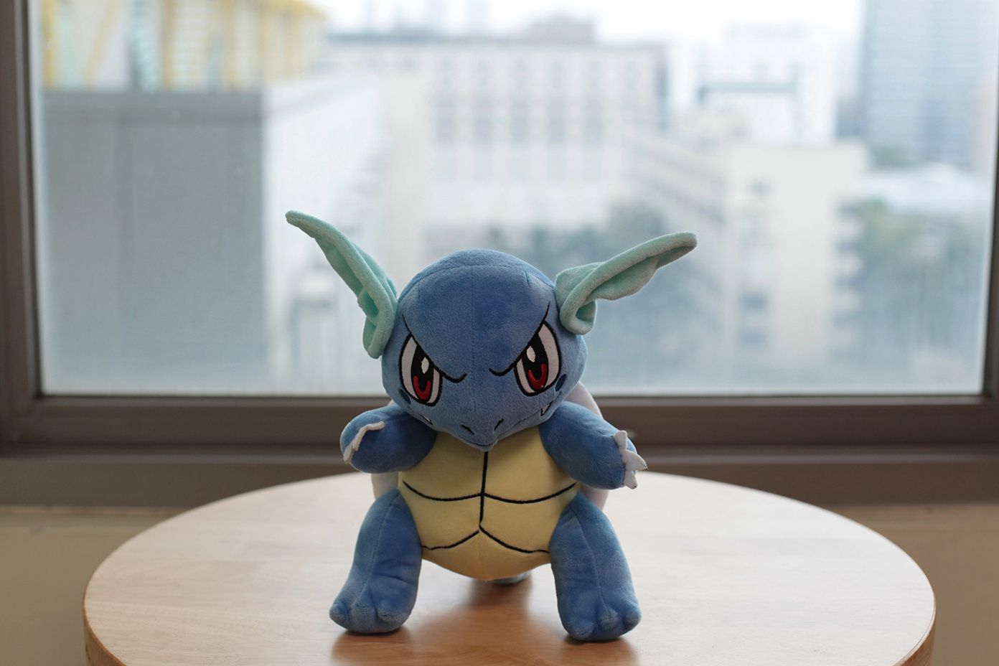
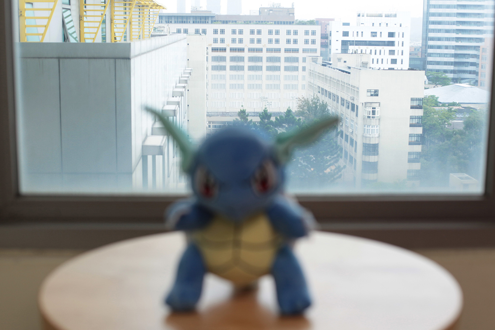
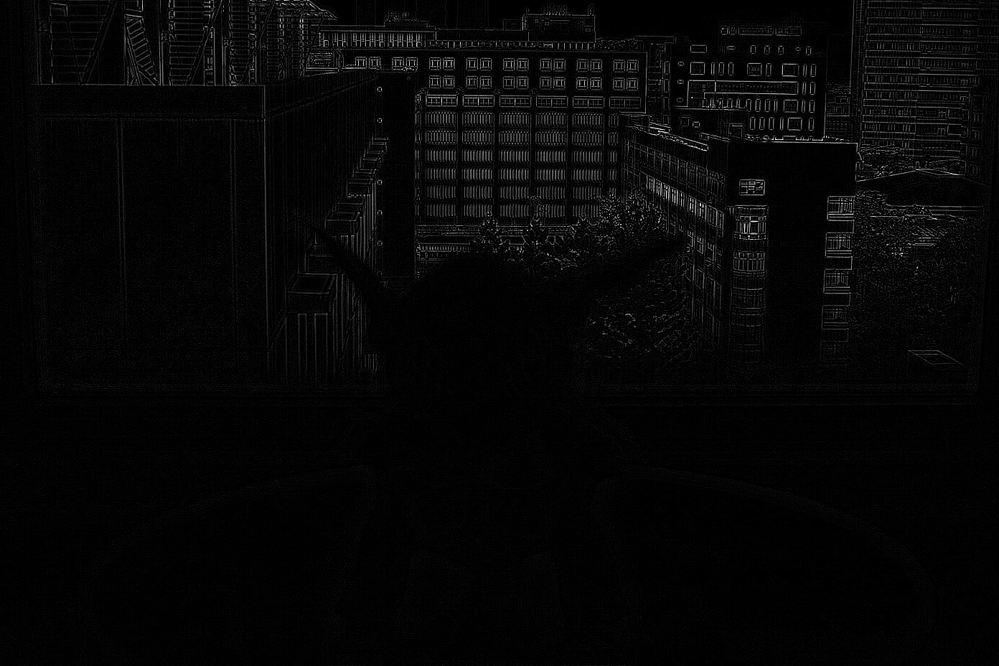
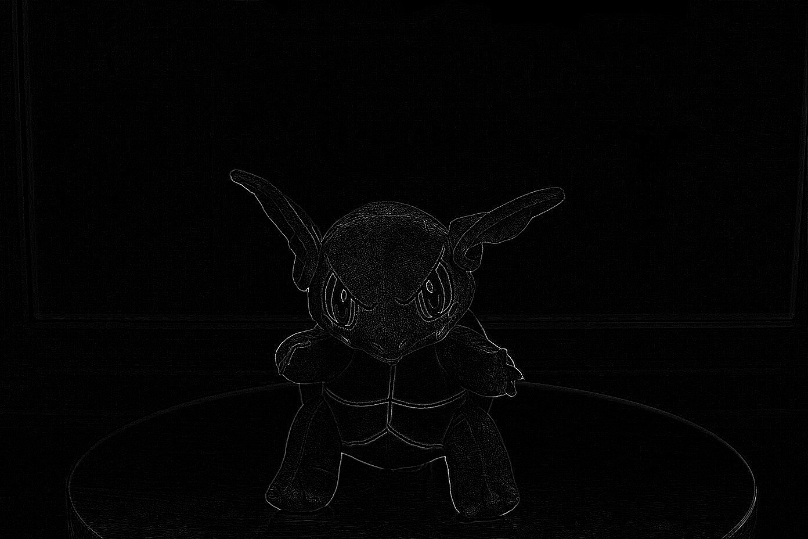
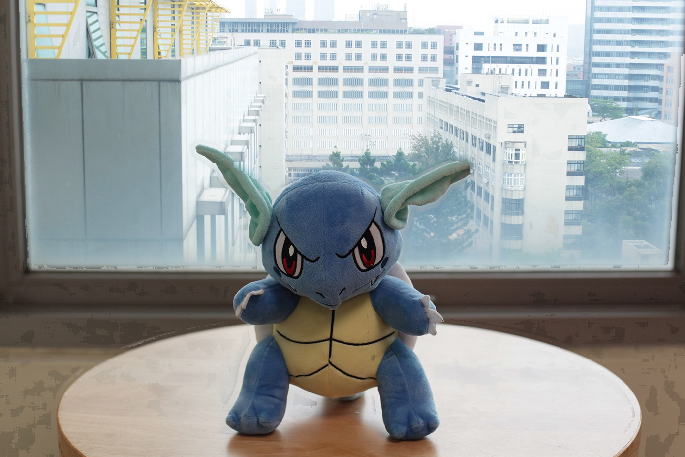
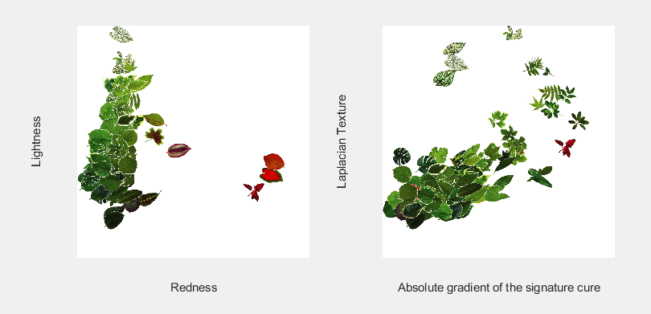

# HW2

* writing in python & matlab

## Run
```bash
# hw2-1
python 1.py
#hw 2-2-1- ~ hw 2-2-3
python 2-1-2.py
python 2-3.py
```

## HW2-1 *Extended Depth of Field

* Focus on front and back scene
<div>


<div>

* Transfer into binary
<div>


<div>

* Output
<div>

<div>

## HW 2-2 *Simulation of Disordered Vsion


* Red-Green color blindness
1. RGB to Lab
2. a*=0
3. Lab to RGB


* Blue-Yellow color blindness
1. RGB to Lab
2. b*=0
3. Lab to RGB


* Glaucoma
1. create a gaussian-kernel with size of input images.
2. sigma of guassian should be bigger.
3. imgage = image(RGB) .* gaussian-kernel.


## [HW2.3 - Analysis Leaves by Hyperspace](HW2_3.m)

Using ``Matlab`` to analysis features of leaves.

* [Main.m](HW2_3.m)
* [leaveFeature.m](leaveFeature.m)
* [featureDistribution.m](featureDistribution.m)

### Steps

1. load 90 images
2. foreground mask
3. analysis

    * gradient of signature
    * mean brightness by gray
    * red ratio R/(R+G+B)
    * mean high frequency (Laplacian + abs + mean)

4. 1000*1000 white background
5. plot images to relative position by analysis

